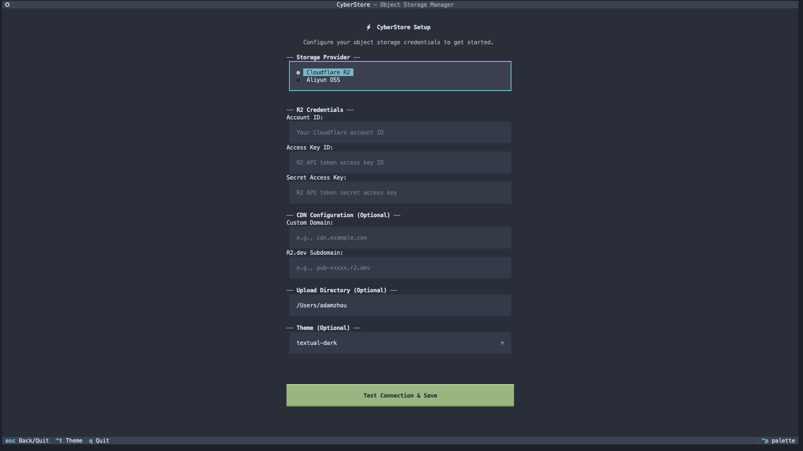

<div align="center">
    
</div>

<p align="center">
    <em>CyberStore - TUI client for object storage — supports Cloudflare R2 && Aliyun OSS.</em>
</p>

<p align="center">
    
    
    
    
    
</p>

---

## Features

- Browse buckets and objects with a file-tree sidebar
- Upload / download files with progress bar
- Delete single or multiple objects (multi-select with `Space`)
- Generate presigned URLs and CDN links
- Create buckets
- Fuzzy search within a bucket
- Switch between Cloudflare R2 and Aliyun OSS

---

## Installation

Install via the install script (downloads the latest release binary):

```bash
curl -fsSL https://raw.githubusercontent.com/amazingchow/CyberStore/main/scripts/install.sh | bash
```

Optional environment variables:

- `INSTALL_DIR` — Directory to install the binary (default: `/usr/local/bin`). Example, install to your user bin: `INSTALL_DIR=~/.local/bin bash -c "$(curl -fsSL https://raw.githubusercontent.com/amazingchow/CyberStore/main/scripts/install.sh)"`
- `CYBERSTORE_VERSION` — Pin to a specific release (e.g. `v1.2.0`). Omit to install the latest.

Then run:

```bash
cyberstore
```

---

## Configuration

On first launch, the **Setup** screen appears. Select your storage provider and fill in the credentials.

### Cloudflare R2 (default)

| Field             | Description                                   |
|-------------------|-----------------------------------------------|
| Account ID        | Your Cloudflare account ID                    |
| Access Key ID     | R2 API token access key ID                    |
| Secret Access Key | R2 API token secret access key                |

Credentials are stored in `~/.config/cyberstore/config.toml` under the `[r2]` section.

### Aliyun OSS

| Field              | Description                                               |
|--------------------|-----------------------------------------------------------|
| Endpoint           | OSS endpoint, e.g. `https://oss-cn-hangzhou.aliyuncs.com` |
| Bucket             | OSS bucket name                                           |
| Access Key ID      | Aliyun RAM access key ID                                  |
| Access Key Secret  | Aliyun RAM access key secret                              |

Credentials are stored under the `[oss]` section. The active provider is recorded as `storage_provider = "oss"`.

### CDN (optional, R2 only)

| Field             | Description                               |
|-------------------|-------------------------------------------|
| Custom Domain     | Your CDN domain, e.g. `cdn.example.com`   |
| R2.dev Subdomain  | R2 public bucket subdomain                |

### Example `~/.config/cyberstore/config.toml`

```toml
storage_provider = "r2" # or "oss"

[r2]
account_id = "abc123"
access_key_id = "..."
secret_access_key = "..."

[oss]
endpoint = "https://oss-cn-hangzhou.aliyuncs.com"
bucket = "my-bucket"
access_key_id = "..."
access_key_secret = "..."

[cdn]
custom_domain = "cdn.example.com"
r2_dev_subdomain = ""

[preferences]
theme = "textual-dark"
download_path = "/Users/you/Downloads"
upload_path = "/Users/you"
presigned_expiry = 3600
```

---

## Key Bindings

| Key         | Action             |
|-------------|--------------------|
| `u`         | Upload file        |
| `d`         | Download file      |
| `x`         | Delete object(s)   |
| `l`         | Get links          |
| `i`         | Object info        |
| `c`         | Copy object key    |
| `r`         | Refresh            |
| `/`         | Search             |
| `Escape`    | Clear search       |
| `Space`     | Toggle select      |
| `Backspace` | Go up one level    |
| `n`         | New bucket         |
| `f`         | New folder         |
| `s`         | Open setup         |
| `Ctrl+T`    | Cycle theme        |
| `q`         | Quit               |
